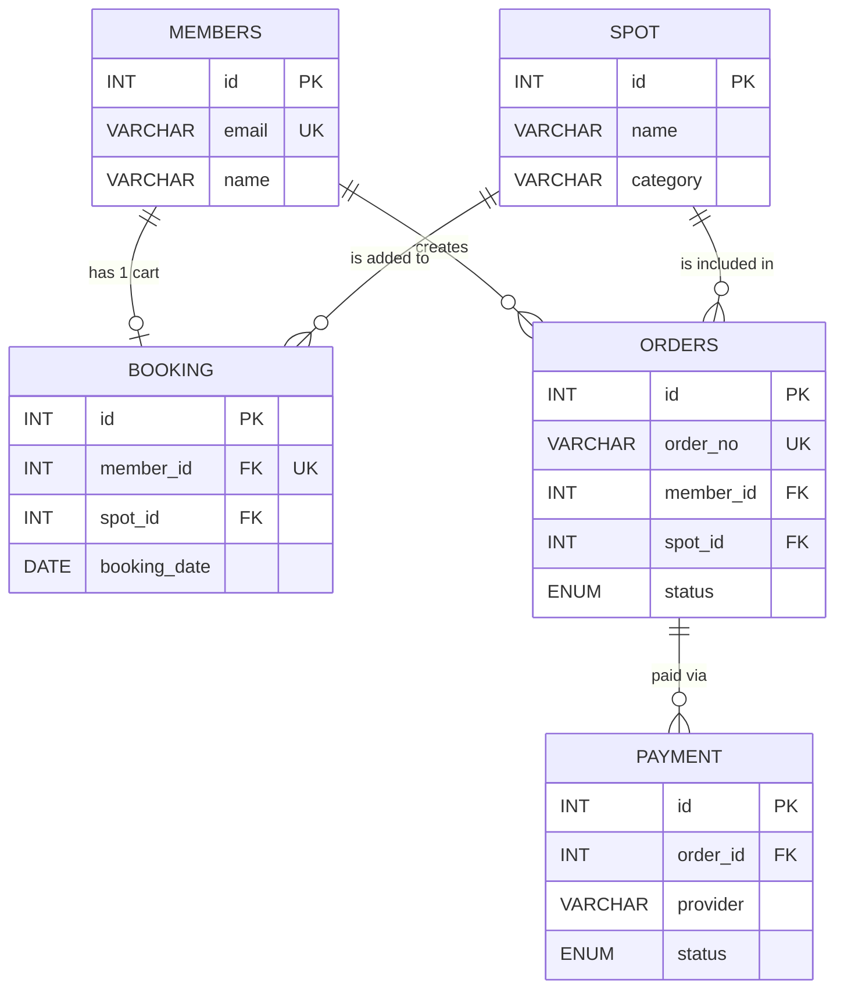

# Taipei Day Tour

A travel e-commerce platform built on a decoupled architecture, featuring a comprehensive shopping and checkout flow.

[Live Demo](https://taipeidaytour.linkuankuan.com/) | [API Documentation](https://taipeidaytour.linkuankuan.com/docs)

## 🌟 Features

* **Database Design:** Designed a relational **MySQL** database schema for shopping cart and order management, and implemented a **Connection Pool** to efficiently manage database connections.
* **API Architecture Design:** Developed a RESTful backend API using **FastAPI** to handle core business logic within a decoupled (frontend/backend) architecture.
* **Payment Gateway Integration:** Integrated **TapPay API** to implement online credit card payments, ensuring secure transaction authorization and deduction processes.
* **Security & Authorization:** Built an independent user authentication system using **JWT (JSON Web Tokens)** for stateless login and API access control, alongside secure password hashing.

## 🛠️ Tech Stack

* **Backend:** Python, FastAPI
* **Database:** MySQL, Connection Pool
* **Frontend:** JavaScript, HTML, CSS
* **Infrastructure:** Docker, AWS (EC2 / RDS), Nginx
* **Third-Party API:** TapPay API

## ERD

## 🔌 API Endpoints

| Method | Endpoint | Description  | Authentication |
| ------ | -------- | ---------------------- | --------------------- |
| POST   | `/api/user` | Register a new user  | None |
| GET    | `/api/attractions` | Get attraction list with pagination | None |
| POST   | `/api/booking` | Add an attraction to the shopping cart | JWT Required |
| POST   | `/api/orders` | Create a new order and initialize payment | JWT Required |

## Screenshots
* **Homepage**

* **History Order page**

* **Booking page**

 test account

| Account | Password | 
| ------ | ------ |
| test@mail.com | !Q12345678 |
